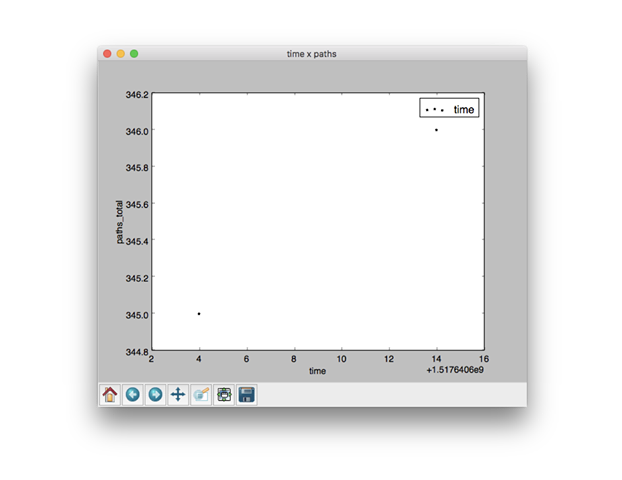

# aflpaths
Python script to generate a time*path scatterplot for American Fuzzy Lop plot_data
# usage:
```
aflpaths plot_data
```
# input:
```
# unix_time, cycles_done, cur_path, paths_total, pending_total, pending_favs, map_size, unique_crashes, unique_hangs, max_depth, execs_per_sec
1517640604, 0, 0, 345, 345, 43, 6.28%, 0, 0, 1, 39.62
1517640614, 0, 0, 346, 346, 43, 6.28%, 0, 0, 2, 143.85
```
# output

